autodice
========

A computer vision tool to read the result of a dice roll. Released
under the WTFPLv2.

How it works
============

A photo of every side of the die being tested gets put in the `ref/`
directory. They will act as reference pictures.

When the dice gets rolled, a photo of the side is taken and is
compared against the reference pictures. If one reference picture fits
clearly more than all the other reference pictures, this is our roll.

To check for image similarity, we use OpenCV and SIFT to generate
image features that are scale, translation and rotation-invariant. We
then compare the features of the two pictures to see which fits most.

All pictures are assumed to be taken under the same angle and same
lighting conditions, so the scale of the dice and its position in the
photo will not change ; we just have to deal with rotation. This is
why the comparison algorithm strongly favors features that match a
similar radius and that are close to the center of the die.

Usage
=====

## `./autodice.py autocrop <in.png> <out.png>`

Autocrop an image using Canny edge detection. All images must be
cropped this way to ensure consistent positioning of the die in the
picture.

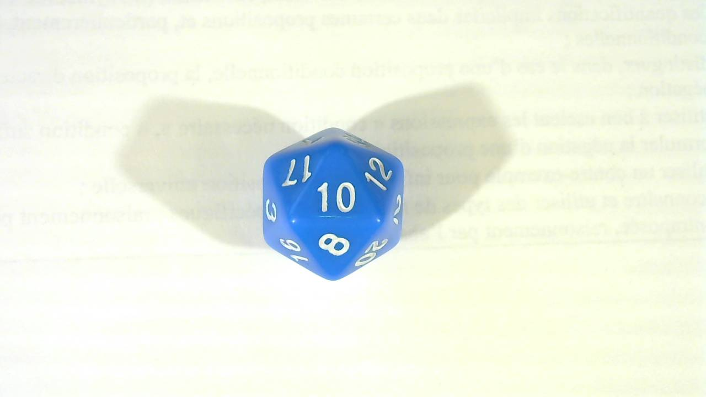 | 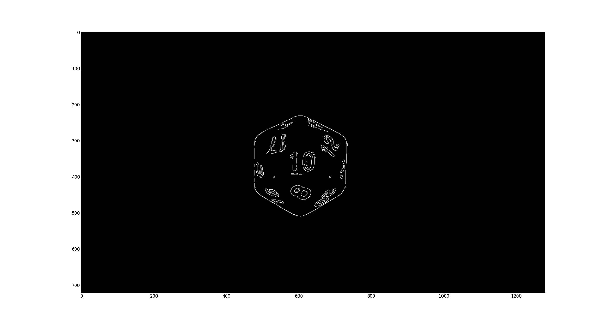 | 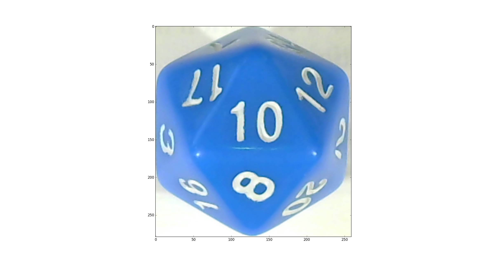
--- | --- | ---
Original picture | After edge detection | Autocrop result

## `./autodice.py autocrop-test <in.png>`

Autocrop an image and display the result instead of saving it. Useful
for debugging and tweaking with the threshold values of the edge
detection algorithm.

## `./autodice.py match-test <A.png> <B.png>`

Try to match two images and display the results (and computed
similarity scores, higher is better).

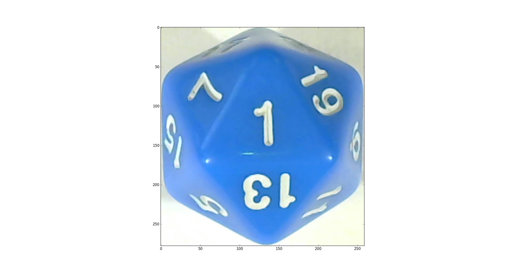 | 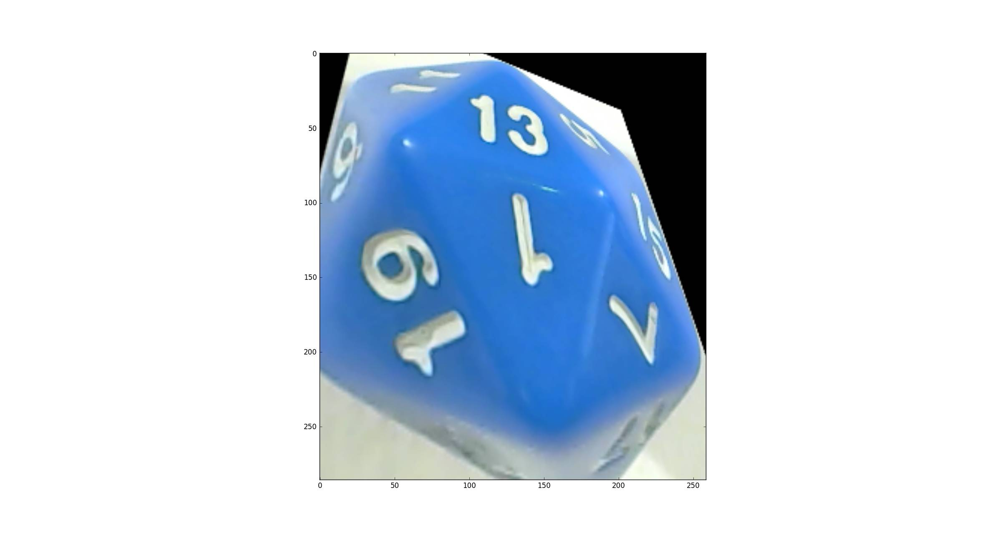 | 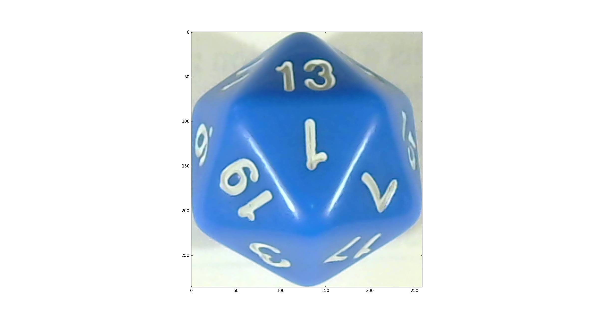 | 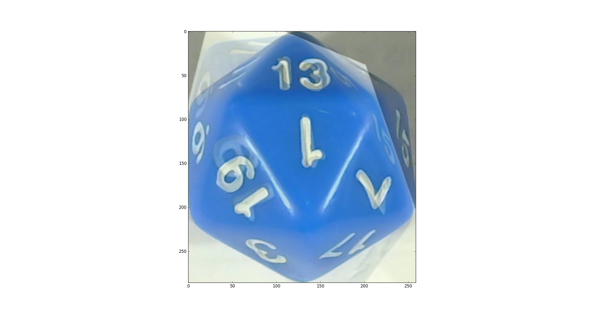 | 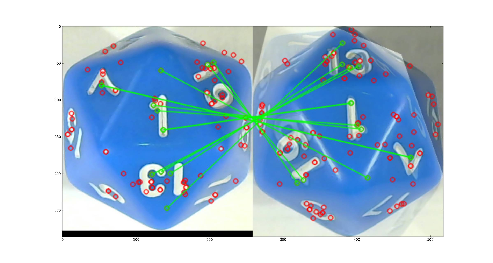
--- | --- | --- | --- | ---
Picture A | Best homography against B | Picture B | Blend | Matched features (inliers only)

The final score for this match is -2.907422.

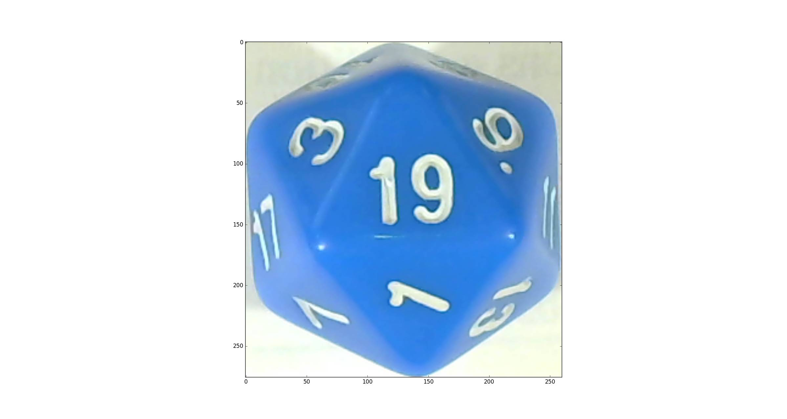 | 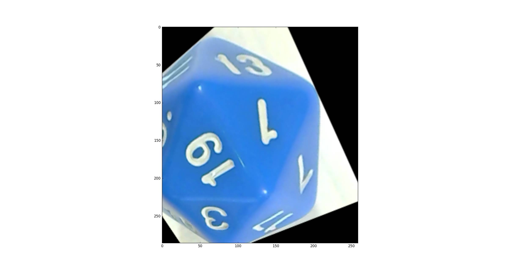 |  | 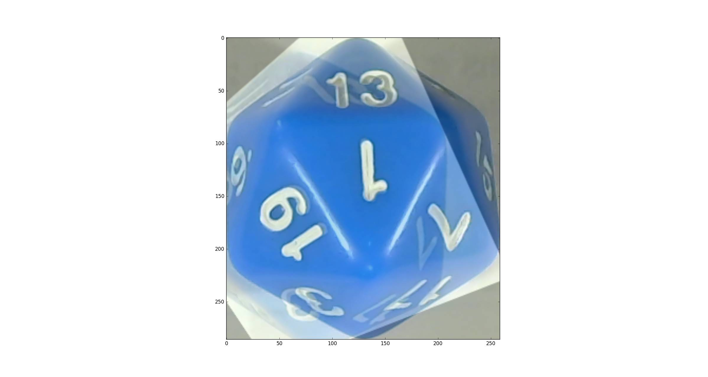 | 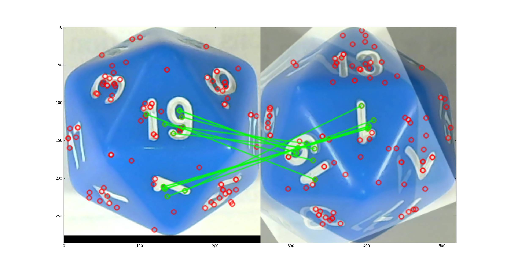
--- | --- | --- | --- | ---
Picture A | Best homography against B | Picture B | Blend | Matched features (inliers only)

The final score for this match is -3.919105. Although the match seems
better, the inliers are penalized because they do not match an overall
equivalent side (top to side or side to top).

## `./autodice.py match-ref <image.png> …`

Match a collection of images against the reference pictures. Output is like this:

      ./autodice.py match-ref dataset/*.png

      dataset/foo.png 13
      dataset/bar.png 7
      dataset/baz.png 10?

If the algorithm is unsure, it will put a question mark after its best
guess. No question mark does not mean the result is guaranteed to be
correct, it just means the algorithm is fairly sure to be correct.

This command assumes that the files are correctly named in `ref/` (if
you are testing a d20, `ref/` should have `1.png`, `2.png`, …,
`20.png`).
